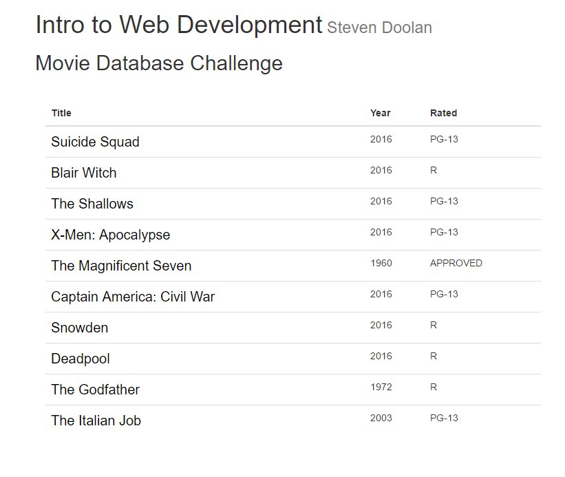

# Rose Hulman Hackers
### _Front End Talk_
_Created By Steven Doolan_

This talk has no prereqs but is a suggested prereq of further Web Development talks. The talk will cover HTML/CSS/Javascript basics with a high level overview. Should time permit, [Bootstrap](http://getbootstrap.com/) and [Knockout](http://knockoutjs.com/) will be introduced.

### The Project
The Movie Database Challenge displays a table of our favorite moves and uses the [Open Movie Database API](http://www.omdbapi.com/) to get more detailed information. The end project will consit of two html pages. 

### Setup
Download or clone the the [github repository](https://github.com/RoseHulmanHackers/IntroToWebTalk). Durring the talk we will start with the starting code directory. The repo includes additional directories to surve as waypoints incase you get lost or attempt this outside of the talk

### Additional Resources
* [w3 Schools] (http://www.w3schools.com/)
* [Codecademy](https://www.codecademy.com/learn) 
* [Rose Robotics](http://www.rosebotics.org/courses)
* [Bootstrap](http://getbootstrap.com/) CSS/Javascript Framework
* [Knockout](http://knockoutjs.com/) Javascript Framework
* [Regexr](http://regexr.com/) - For Regular Expressions. Works cross languages

### Finished Product
##### Completed Faviotes Table (index.html)

##### Completed Movie Search (movie.html)

